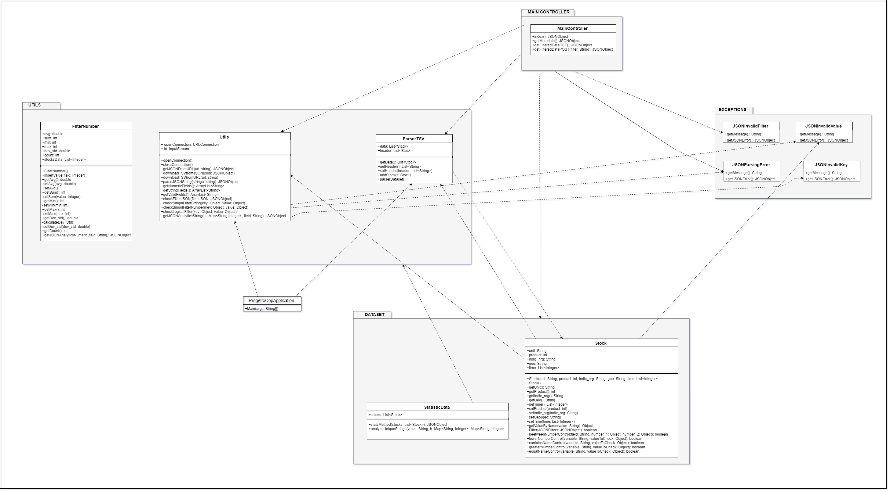
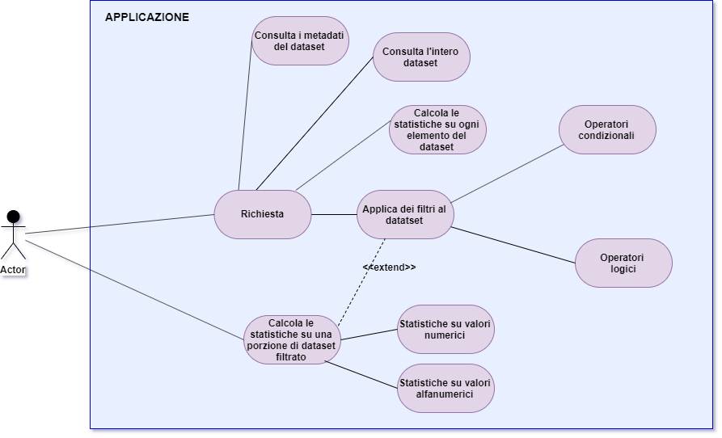

# Progetto di Programmazione ad Oggetti
### Autori: *Asya Pesaresi e Lorenzo Vagnini*

## Descrizione del Progetto
L'applicazione da noi sviluppata presente nella repository è un progetto Java che permette di decodificare un file JSON e scaricare i dati contenuti in esso in un file di tipo TSV (Tab Separated Value). In seguito è possibile applicare dei filtri ai dati e ottenere delle statistiche sui vari campi.
Il file contiene tutti i dati riguardanti la produzione di energia elettrica, suddivisi per mese e anno, dei paesi dell'Unione Europea.
Il dataset è contenuto al seguente indirizzo URL : https://ec.europa.eu/eurostat/estat-navtree-portlet-prod/BulkDownloadListing?file=data/nrg_ind_342m.tsv.gz&unzip=true.

Categorie dei dati presi in considerazione:

|Campo|Descrizione|
|-|-|
|Unit|Unità di misura(GWH)|
|Product|Codice Prodotto|
|Indic_nrg|Indice|
|Geo|Nazione|
|Time|Anno e mese |

-----
## Funzionamento del Progetto
L'applicazione crea un server locale tramite SpringBoot all'indirizzo http://localhost:8080.
Per ottenere tutte le informazioni si utilizza una API REST GET che permette di:
* Restituire i metadati (elenco attributi e tipo).
* Restituire i dati (integralmente o filtrati).
* Restituire delle statistiche sui dati specificando l'attributo da prendere in considerazione.

Il JSON rappresentante i metadati si presenta sotto questa forma:

```javascript
{
    "id": "urn:jsonschema:org:univpm:projectoop:dataset:Stock",
    "type": "object",
    "properties": {
        "geo": {
            "type": "string"
        },
        "unit": {
            "type": "string"
        },
        "product": {
            "type": "integer"
        },
        "indic_nrg": {
            "type": "string"
        },
        "time": {
            "type": "array",
            "items": {
                "type": "integer"
            }
        }
    }
}
```


-----

Il JSON rappresentante un singolo elemento del dataset si presenta sotto questa forma:

```javascript
{
    "unit": "GWH",
    "product": 6000,
    "indic_nrg": "B_190300",
    "geo": "AT",
    "time": [2225, 1718, 1833, 1282, 1589, 1750, 2592, 2610, 2916, 3058, 2679, 2971, 1546, … ]
}
```

-----

Le statistiche posso essere rilevate su ogni specifica categoria.
Per i dati di tipo numerico si possono calcolare Somma, Massimo, Minimo, Media, Deviazione Standard e Numero degli elementi.
Per i dati di tipo stringa si puo' calcolare il numero di occorrenze di ogni singola stringa.

Il JSON rappresentante le statistiche si presenta sotto questa forma:

```javascript
{
"Dati":[
  {
    "Dati":[
      { "Contatore": 30, "Valore": "GWH" }
    ],
    "Tipo": "String",
    "Attributo": "Unit"
  },
  {
    "Dati":{
      "Somma": 180000,
      "DeviazioneStandard": 0,
      "Conteggio": 30,
      "Massimo": 6000,
      "Media": 6000,
      "Minimo": 6000
    },
    "Tipo": "Integer",
    "Attributo": "Product"
  },
  {
    "Dati":[
      {"Contatore": 30, "Valore": "B_190500"}
    ],
    "Tipo": "String",
    "Attributo": "Indic_nrg"
  }
  ...
}
```

-----
## Route dell'applicazione

* Route che restituisce i dati del dataset in formato JSON:
>**GET** /

* Route che restituisce i metadati in formato JSON:
>**GET** /getMetadata

* Route che restituisce il JSON contenente le analisi sui dati dell'intero dataset:
>**GET** /getFilteredData

* Route che restituisce il JSON contenente le analisi sui dati filtrati:
>**POST** /getFilteredData

-----

## Applicazione dei filtri

Per applicare dei filtri al dataset bisogna inserire i filtri nel corpo della richiesta POST che è una stringa formato JSON composta da oggetti così strutturati:

screen richiesta post con filtri

I filtri possono essere applicati ai campi riportati in tabella precedentemente.
I filtri applicabili sono i seguenti:

### Operatori logici:

|Operatore|Descrizione|Esempio|
|-|-|-|
|$or|Operatore logico "or"|{"$or": [ { "field" : "value"},{"field" : "value" } ] }|
|$and|Operatore logico "and"|{"$and": [ {"field" : "value"},{"field" : "value"} ] }|
|$in|Abbina ogni elemento con lo stesso valore|	{"field" : { "$in" : [value]}}|
|$nin|Abbina ogni elemento che non ha un determinato valore|{"field" : { "$nin" : [value]}}|
|$not|Operatore logico "not|{"field" : {"$not" : val}}|


### Operatori condizionali:

|Operatore|Descrizione|Esempio|
|-|-|-|
|$bt|>=value <=|{"field" : {"$bt" : [value1, value2]}}|
|$gte|>=|{"salary": {"$gte": 10000}}|
|$gt|>|{"salary": {"$gt": 10000}}|
|$lt|<|{"salary": {"$lt": 10000}}|
|$lte|<=|{"salary": {"$lte": 10000}}|

La richiesta POST contiene al suo interno il filtro. Ogni filtro è un oggetto JSON di tipo stringa strutturato come segue:

```javascript
{
    "<campo>": {
	    "<operatore>": <dato>
	}
}
```
-----
## DIAGRAMMI UML
### Diagramma delle classi:
descrive il tipo degli oggetti che compongono il sistema e le relazioni statiche esistenti tra loro



### Diagramma dei casi d'uso:
Si tratta di un diagramma che esprime un comportamento,desiderato o offerto.
Individua chi o che cosa ha a che fare con il sistema(attore) e che cosa l’attore può fare (caso d’uso).



### Diagramma delle sequenze:
Un diagramma di sequenza è un diagramma previsto dall'UML utilizzato per descrivere una determinata sequenza di azioni in cui tutte le scelte sono state già effettuate; in pratica nel diagramma non compaiono scelte, né flussi alternativi.


